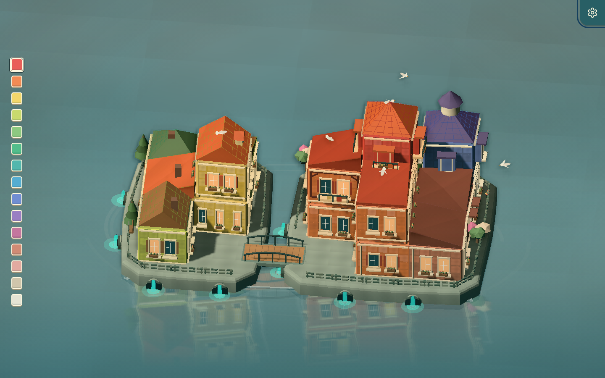

# Harborlight (한국어판)

> **해안선을 빚어보세요** — 작은 항구 마을을 손으로 짓는 미니멀 토이 게임
> Three.js · TypeScript · Vite · 한국어 / 영어 / 베트남어

Harborlight는 물 위에 집을 짓고, 다리를 놓고, 색을 골라 직접 마을을 빚어가는 작은 토이 게임입니다. 한 손가락(또는 마우스 한 클릭)만으로 6층짜리 타워까지 자라나는 미니어처 항구를 자유롭게 만들 수 있습니다. 원본은 [tuannd9288/harborlight](https://github.com/tuannd9288/harborlight)에서 공개된 MIT 라이선스 프로젝트이며, 본 저장소는 **한국어 인터페이스와 GitHub Pages 배포**를 위해 한글화한 포크입니다.

🌐 **라이브 데모**: <https://sigco3111.github.io/harborlight/>



---

## ✨ 주요 특징

| | |
|---|---|
| 🎮 **즉시 플레이** | 별도 설치 없이 브라우저에서 바로 — `npm install` → `npm run dev`만으로 1분 안에 동작 |
| 👆 **터치 우선** | 한 손가락 짓기 · 길게 누르기 지우기 · 두 손가락 핀치 줌 — 모바일과 데스크톱 모두 자연스럽게 |
| 🎨 **16색 팔레트** | 양귀비에서 항구 블루까지, 도시·해안·식물 어디에나 어울리는 색을 고를 수 있습니다 |
| 🔁 **자유로운 되돌리기** | 실행 취소 / 다시 실행이 무제한 — 마음에 들 때까지 실험하세요 |
| 💾 **자동 저장** | 한 번 만든 마을은 같은 기기에 자동 저장됩니다. URL의 `#해시`만 복사해 누구에게나 공유하세요 |
| 🔊 **은은한 사운드** | 파도, 새, 짓기·지우기 효과음이 분위기를 살립니다 (켜고 끄기 자유) |
| 🌍 **3개 언어** | 한국어 / 영어 / 베트남어 — 우상단 ⚙ 설정 다이얼에서 즉시 전환 |
| 📱 **반응형 디자인** | 폰·태블릿·노트북 어디서든 같은 경험을 제공합니다 |

---

## 🚀 빠른 시작

### 1) 라이브로 바로 플레이

> 별도 설치 없이 브라우저에서 즉시 — <https://sigco3111.github.io/harborlight/>
>
> ⚠️ 음소거 상태로도 잘 작동하지만, 한 번 화면을 클릭하면 효과음이 활성화됩니다 (브라우저 자동재생 정책).

### 2) 로컬에서 빌드하고 실행

**사전 요구사항**: Node.js 18 이상 · npm 9 이상

```bash
# 1. 저장소 클론
git clone https://github.com/sigco3111/harborlight.git
cd harborlight

# 2. 의존성 설치 (lock 파일 기반, 결정적 빌드)
npm install

# 3. 개발 서버 시작 (보통 http://127.0.0.1:5173/)
npm run dev

# 4. 프로덕션 빌드 (tsc 타입체크 + vite 번들)
npm run build

# 5. 빌드 결과 미리보기
npm run preview

# 6. 단위 테스트 (vitest)
npm test
```

빌드 산출물은 `dist/` 폴더에 생성되며, 정적 호스팅 어디든 그대로 업로드할 수 있습니다.

---

## 🎮 게임 가이드

### 기본 조작 (데스크톱)

| 동작 | 입력 |
|---|---|
| **짓기** | 물, 기초, 옥상, 건물의 옆면을 **클릭** |
| **지우기** | 지어진 칸을 **우클릭** |
| **둘러보기** | 마우스를 **드래그**해 마을을 회전 |
| **줌인 / 줌아웃** | 마우스 **스크롤** |
| **색 빠르게 선택** | 키보드 **1–9** |
| **실행 취소** | **Ctrl/⌘ + Z** |
| **다시 실행** | **Shift + Ctrl/⌘ + Z** (또는 **Ctrl/⌘ + Y**) |

### 기본 조작 (모바일 / 터치)

| 동작 | 입력 |
|---|---|
| **짓기** | 물, 기초, 옥상, 건물의 옆면을 **탭** |
| **지우기** | 지어진 칸을 **길게 누르기** |
| **둘러보기** | 한 손가락으로 **드래그** |
| **줌인 / 줌아웃** | 두 손가락으로 **핀치** |

### ⚙️ 설정 다이얼 (우상단 톱니바퀴)

설정 메뉴에서는 다음을 조절할 수 있습니다.

- ↩️ **실행 취소 / 다시 실행** — 마음에 들지 않으면 무제한 되돌리기
- 🎲 **무작위 마을** — 한 번에 새로운 항구 생성
- 💾 **저장** — 현재 마을을 엽서 이미지로 저장 (Postcard)
- 🔲 **건물 격자 표시 / 숨기기** — 정확한 위치 잡기를 원할 때
- 🔊 **소리 켜기 / 끄기** — 파도, 새, 짓기 효과음 토글
- ❓ **플레이 방법** — 이 README의 가이드를 다시 보여줍니다
- 🌐 **언어** — 한국어 · 영어 · 베트남어 순환 토글
- 🧹 **마을 비우기** — 처음 상태로 초기화

> 💡 **공유 팁**: URL 끝의 `#abc123` 같은 해시가 마을 전체 상태를 담고 있습니다. 이 URL만 복사해 누구에게나 보내면 같은 마을이 그대로 복원됩니다.

---

## 🎨 색상 팔레트 (16색)

| # | 이름 | 한국어 |
|---|---|---|
| 0 | Poppy | 양귀비 |
| 1 | Tangerine | 귤 |
| 2 | Butter | 버터 |
| 3 | Citron | 레몬그라스 |
| 4 | Sage | 세이지 |
| 5 | Jade | 비취 |
| 6 | Lagoon | 라군 |
| 7 | Sky | 하늘 |
| 8 | Periwinkle | 페리윙클 |
| 9 | Heather | 히스 |
| 10 | Rose | 로즈 |
| 11 | Clay | 테라코타 |
| 12 | Shell | 셸 |
| 13 | Limestone | 라임스톤 |
| 14 | Chalk | 초크 |
| 15 | Harbor Blue | 항구 블루 |

색상 인덱스 0–14가 화면의 메인 팔레트, 인덱스 15(`Harbor Blue`)는 다리·특수 구조물에 사용되는 추가 색입니다.

---

## 🌍 다국어 지원

Harborlight는 빌트인 i18n 인프라를 갖추고 있으며, 다음 3개 언어를 기본 제공합니다.

| 코드 | 언어 | 코드 표시 | 상태 |
|---|---|---|---|
| `ko` | 한국어 | **KOR** | ✅ 본 저장소 메인 |
| `en` | English | **ENG** | ✅ 원본 |
| `vi` | Tiếng Việt | **VIE** | ✅ 원본 |

언어 선택은 `localStorage["harborlight-language"]`에 저장되며, 다음에 사이트를 열 때 자동으로 복원됩니다. 처음 방문 시에는 `navigator.language`를 자동 감지해 한국어 사용자에게는 한국어가, 베트남어 사용자에게는 베트남어가, 그 외에는 영어가 표시됩니다.

### 번역 파일 위치

모든 번역 데이터는 `src/i18n.ts` 한 파일에 모여 있습니다 — `ENGLISH`, `VIETNAMESE`, `KOREAN` 세 객체가 `HarborMessages` 타입을 만족하는 구조입니다. 새 언어를 추가하려면:

1. `export type Locale`에 새 코드 추가 (예: `"ja"`)
2. `isLocale()` 함수의 화이트리스트에 추가
3. `getInitialLocale()` 의 navigator 감지 분기 추가
4. `MESSAGES` 레코드에 새 객체 등록
5. `src/i18n.test.ts`에 검증 케이스 추가

---

## 🛠 기술 스택

| 영역 | 기술 |
|---|---|
| **언어** | TypeScript 5.9 (strict 모드) |
| **렌더링** | Three.js r180 (WebGL) |
| **번들러** | Vite 7 |
| **테스트** | Vitest 4 (단위 테스트) |
| **빌드 출력** | `dist/` 정적 파일 (어디든 호스팅 가능) |

### 디렉토리 구조

```
harborlight/
├── index.html                    # 엔트리 + FOUC 한국어 메타
├── vite.config.ts                # base: '/harborlight/' (gh-pages 서브패스)
├── tsconfig.json
├── package.json
├── public/                       # 정적 자산
│   ├── harborlight.svg           # 파비콘
│   └── _redirects                # Netlify / Pages 규칙
├── comparison/                   # Townscaper × Harborlight 비교 페이지
│   └── index.html
├── docs/
│   └── screenshots/
│       └── harborlight-preview.png   # README 메인 스크린샷
├── src/
│   ├── main.ts                   # 부트스트랩 + 이벤트 루프
│   ├── i18n.ts                   # ★ 다국어 메시지 + Locale 타입
│   ├── i18n.test.ts              # ★ i18n 회귀 테스트
│   ├── ui.ts                     # HUD + 다이얼 + 3-way 언어 토글
│   ├── renderer.ts               # Three.js 렌더링 (4677줄)
│   ├── world.ts                  # 월드 모델 (555줄)
│   ├── audio.ts                  # 사운드 엔진
│   ├── config.ts                 # 상수 + 16색 팔레트
│   ├── types.ts                  # 타입 정의
│   └── style.css                 # UI 스타일
└── dist/                         # 빌드 산출물 (git ignore)
```

---

## 📜 라이선스 및 출처

본 저장소는 원본 [tuannd9288/harborlight](https://github.com/tuannd9288/harborlight)의 포크이며, 원본과 동일한 **MIT 라이선스**를 따릅니다. 원본의 모든 권리는 원작자(`@tuannd9288`)에게 있으며, 본 포크는 **인터페이스 한국어화**와 **GitHub Pages 배포**라는 추가 가치를 제공합니다.

```
MIT License — Copyright (c) 2024 tuannd9288 (원본)
                 2026 sigco3111 (한국어 포크)
```

원본 저장소에서 더 자세한 제작 의도, 디자인 결정, 그리고 `comparison/index.html`로 제공되는 Townscaper × Harborlight 비교 페이지를 확인할 수 있습니다.

---

## 🙏 감사의 말

- 원작자 **`@tuannd9288`** — 이 작은 토이 게임을 세상에 공개해주셔서 감사합니다.
- **Three.js** 커뮤니티 — 놀라운 WebGL 라이브러리를 무료로 제공해주셔서.
- **Vite** 팀 — 빠르고 견고한 빌드 도구를 만들어주셔서.
- 한국어 사용자분들 — 이제 모국어로 즐기실 수 있습니다 🎉
